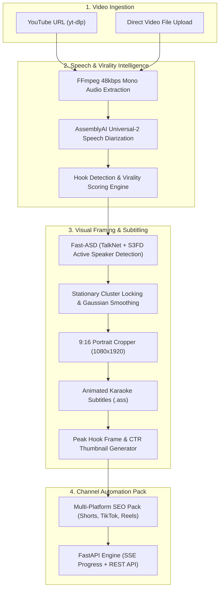

# ClippedAI

Autonomous AI Content Engine that transforms long-form videos into viral, platform-ready 9:16 vertical clips with active speaker tracking, word-synced kinetic subtitles, hook thumbnails, and multi-platform SEO packages.

---

## Architecture



---

## Core Features

### 1. Active Speaker Detection & Diarization-Visual Fusion
- **Fast-ASD (TalkNet + S3FD)**: Combines audio-visual lip synchrony tracking with robust face detection natively on Apple Silicon (MPS) or CPU with zero cloud GPU dependencies.
- **Diarization-Visual Fusion**: Maps AssemblyAI word timestamps and speaker IDs to visual face locations, eliminating identity confusion and false switches during banter or overlapping speech.

### 2. Adaptive Multi-Speaker Split-Screen Framing
- **Intelligent Split-Screen Layouts**:
  - **2 Speakers**: Automatically stacks both speakers vertically (`_render_split_2`, 1080×960 per cell) during wide shots.
  - **3 Speakers**: Renders featured speaker on top (1080×960) with two active participants side-by-side on the bottom (`_render_split_3`, 540×960 each).
  - **4 Speakers**: Renders a clean 2×2 panel grid (`_render_split_4`, 540×960 each).
- **2D AR-Safe Headroom Framing (`_ar_safe_crop`)**: Preserves the exact aspect ratio of each cell with natural vertical headroom ($cy = 0.42$), eliminating distortion and unexpected zoom cutoffs across all input video resolutions.

### 3. Camera Motion Stabilization & Cluster Locking
- **Stationary Cluster Locking**: Groups speaker positions into spatial clusters (`signal_helpers.py`). When speakers are stationary, the framing locks completely with **zero micro-jitter, zero drift, and zero horizontal panning**.
- **Instant Snap-Cuts**: Snaps immediately to new speakers or camera angles upon speech transitions, preventing awkward slow pans across cuts.
- **PySceneDetect Hard Cuts**: Detects camera angle changes (`ContentDetector(threshold=27.0)`) and enforces hard cuts.
- **Motion-Only Smoothing**: Applies Gaussian temporal filtering ($\sigma = 12$) exclusively when a speaker physically moves across the source frame.

### 4. Hook Detection & Semantic Word Boundary Snapping
- Identifies high-retention segments (20–45s) scored on psychological retention triggers (*Curiosity Gap*, *Contrarian*, *Insight*).
- **Semantic Boundary Snapping**: Snaps clip cut points to exact spoken word boundaries from transcript timestamps and applies natural breath buffers (-0.2s start, +0.3s end) so words are never clipped mid-syllable.

### 5. Layout-Aware Dynamic Karaoke Subtitles
- **Layout Awareness**: In `SPLIT` mode, subtitles automatically center at `{\an5\pos(540,960)}` directly on the dividing seam between stacked speakers, ensuring captions never overlap either face. In `SINGLE` mode, captions sit in the lower third.
- **Creator Typography**: Styled in popular creator aesthetics (Hormozi / Komika Axis) with active word glow highlights and soft aura effects.

### 6. Automated Channel Distribution Pack
- **Click-Worthy Hook Thumbnails**: Extracts the emotional peak frame from the hook and composites bold, high-contrast hook text with dark gradient contrast vignettes.
- **Platform-Optimized Copy**: Automatically generates 3 title variations, descriptions, tags, and hashtags tailored specifically for YouTube Shorts, TikTok, and Instagram Reels.

---

## Tech Stack

| Component | Technology |
| :--- | :--- |
| **Backend Framework** | Python 3.10+, FastAPI, Uvicorn |
| **Computer Vision & ASD** | PyTorch, Fast-ASD (TalkNet + S3FD), OpenCV, SciPy |
| **Audio & Speech** | FFmpeg, AssemblyAI Universal-2 Diarization |
| **Language Models** | Google Gemini 2.5 Flash, Groq Llama 3.3 |
| **Video Ingestion** | yt-dlp, FFmpeg |
| **Subtitle Engine** | Advanced SubStation Alpha (`.ass`), Libass |
| **Image Processing** | Pillow (PIL), OpenCV |
| **API Protocols** | REST + Server-Sent Events (SSE) for real-time progress |

---

## Getting Started

### Prerequisites
- Python 3.10 or higher
- [FFmpeg](https://ffmpeg.org/) installed and available in your `PATH`

### 1. Setup Environment
```bash
# Clone the repository
git clone https://github.com/ETS2K7/ClippedAI.git
cd ClippedAI

# Install dependencies
pip install -r backend/requirements.txt
```

### 2. Configure API Keys
Create a `backend/.env` file with your credentials:
```env
# Speech-to-text with word-level timestamps
ASSEMBLYAI_KEY=your_assemblyai_api_key

# Optional: LLM keys (system includes automatic heuristic fallback)
GEMINI_API_KEY=your_gemini_api_key
GROQ_KEY=your_groq_api_key

PORT=8000
HOST=0.0.0.0
```

### 3. Running the Pipeline
You can run ClippedAI via the interactive CLI or the API server:

**Option A: Interactive Creator CLI (Generates Video, Thumbnails & SEO Packs)**
```bash
./cli.py
```
Generated 9:16 clips, hook thumbnails, subtitle files, and the Creator SEO Pack will be automatically saved into individual subfolders inside `test/`.

**Option B: Run the API Server**
```bash
./backend/run.sh
```
The server will start on `http://localhost:8000`.
- Health check: `http://localhost:8000/health`
- Interactive API Docs: `http://localhost:8000/docs`
- Media stream storage: `http://localhost:8000/media/`

---

## API Endpoints

- `POST /api/process`: Ingest YouTube URL or video file
- `GET /api/progress/{task_id}`: Real-time SSE stage updates (0-100%)
- `GET /api/tasks/{task_id}`: Retrieve rendered clips, thumbnails, and SEO packages
- `GET /health`: Health check status
