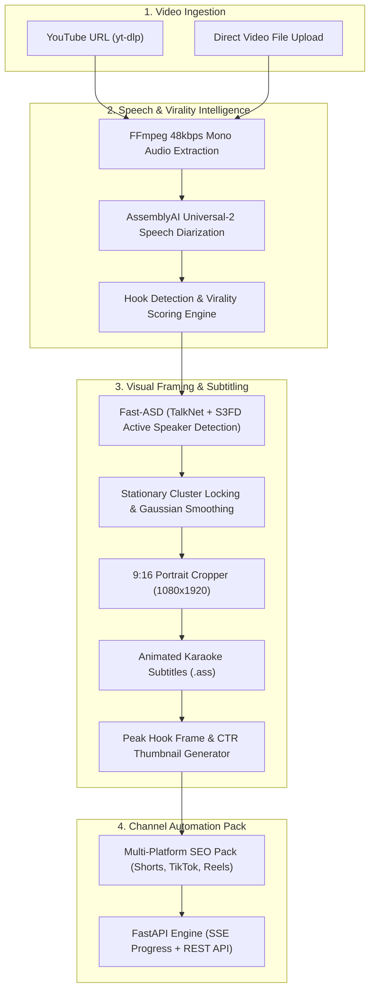

# ClippedAI

Autonomous AI Content Engine that transforms long-form videos into viral, platform-ready 9:16 vertical clips with active speaker tracking, word-synced kinetic subtitles, hook thumbnails, and multi-platform SEO packages.

---

## Architecture



---

## Core Features

### 1. Active Speaker Detection (Fast-ASD)
Unlike basic face detectors that crop blindly or jump erratically between people, ClippedAI uses **Fast-ASD** (combining **TalkNet** audio-visual speech correlation and **S3FD** face detection). It detects visual lip movement synchronized with speech audio to reliably follow who is actually talking in interviews, multi-host podcasts, and panel discussions.

### 2. Camera Motion Stabilization & Cluster Locking
- **Stationary Cluster Locking**: Groups speaker positions into spatial clusters. When a speaker is sitting or standing still, camera position locks to the cluster median, eliminating distracting camera micro-jitter.
- **Natural Speaker Cuts**: Snaps cleanly to new speakers when the active speaker changes, preventing awkward slow pans across cuts.
- **Gaussian Smoothing**: Applies 1D Gaussian temporal filtering for genuine camera pans when a subject walks or moves across the frame.

### 3. Hook Detection & Semantic Word Boundary Snapping
- Identifies high-retention segments (20–45s) scored on psychological retention triggers (*Curiosity Gap*, *Contrarian*, *Insight*).
- **Semantic Boundary Snapping**: Snaps clip cut points to exact spoken word boundaries from transcript timestamps and applies natural breath buffers (-0.2s start, +0.3s end) so words are never clipped mid-syllable.

### 4. Dynamic Karaoke Subtitles
- Generates Advanced SubStation Alpha (`.ass`) subtitles with word-by-word active glow highlights.
- Styled in popular creator aesthetics (Hormozi, Minimal, Cyberpunk) positioned strictly above mobile UI safe zones.

### 5. Automated Channel Distribution Pack
- **Click-Worthy Hook Thumbnails**: Extracts the emotional peak frame from the hook and composites bold, high-contrast hook text with dark gradient contrast vignettes.
- **Platform-Optimized Copy**: Automatically generates 3 title variations, descriptions, tags, and hashtags tailored specifically for YouTube Shorts, TikTok, and Instagram Reels.

---

## Tech Stack

| Component | Technology |
| :--- | :--- |
| **Backend Framework** | Python 3.10+, FastAPI, Uvicorn |
| **Computer Vision & ASD** | PyTorch, Fast-ASD (TalkNet + S3FD), OpenCV, SciPy |
| **Audio & Speech** | FFmpeg, AssemblyAI Universal-2 Diarization |
| **Language Models** | Google Gemini 2.5 Flash, Groq Llama 3.3 |
| **Video Ingestion** | yt-dlp, FFmpeg |
| **Subtitle Engine** | Advanced SubStation Alpha (`.ass`), Libass |
| **Image Processing** | Pillow (PIL), OpenCV |
| **API Protocols** | REST + Server-Sent Events (SSE) for real-time progress |

---

## Getting Started

### Prerequisites
- Python 3.10 or higher
- [FFmpeg](https://ffmpeg.org/) installed and available in your `PATH`

### 1. Setup Environment
```bash
# Clone the repository
git clone https://github.com/ETS2K7/ClippedAI.git
cd ClippedAI

# Install dependencies
pip install -r backend/requirements.txt
```

### 2. Configure API Keys
Create a `backend/.env` file with your credentials:
```env
# Speech-to-text with word-level timestamps
ASSEMBLYAI_KEY=your_assemblyai_api_key

# Optional: LLM keys (system includes automatic heuristic fallback)
GEMINI_API_KEY=your_gemini_api_key
GROQ_KEY=your_groq_api_key

PORT=8000
HOST=0.0.0.0
```

### 3. Run the Engine Server
```bash
python backend/server.py
```
The server will start on `http://localhost:8000`.

- Health check: `http://localhost:8000/health`
- Interactive API Docs: `http://localhost:8000/docs`
- Media stream storage: `http://localhost:8000/media/`

---

## API Endpoints

- `POST /api/process`: Ingest YouTube URL or video file
- `GET /api/progress/{task_id}`: Real-time SSE stage updates (0-100%)
- `GET /api/tasks/{task_id}`: Retrieve rendered clips, thumbnails, and SEO packages
- `GET /health`: Health check status
