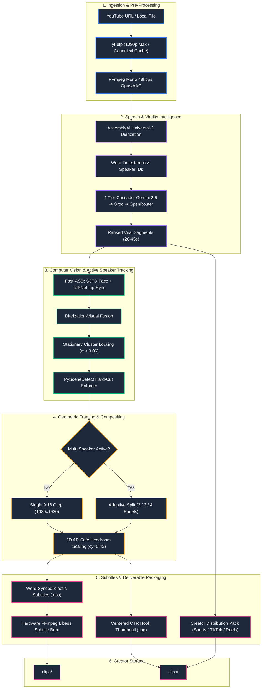

# ClippedAI

> **Autonomous AI Content Engine that transforms long-form horizontal videos into viral, platform-ready 9:16 vertical clips with active speaker tracking, word-synced kinetic subtitles, hook thumbnails, and multi-platform SEO distribution packages.**

[](https://ets2k7.github.io/clipped-ai/)
[](https://www.python.org/)
[](https://pytorch.org/)
[](https://fastapi.tiangolo.com/)
[](https://ffmpeg.org/)
[]()
[]()

👉 **Live Visual Presentation & Clip Showcase:** **[https://ets2k7.github.io/clipped-ai/](https://ets2k7.github.io/clipped-ai/)**

---

## Quick Navigation

- [1. Executive Summary & Problem](#1-executive-summary--problem)
- [2. The ClippedAI Differentiator Matrix](#2-the-clippedai-differentiator-matrix)
- [3. End-to-End System Architecture](#3-end-to-end-system-architecture)
- [4. Deep Dive: Solved Engineering Challenges](#4-deep-dive-solved-engineering-challenges)
- [5. Installation & Local Setup Guide](#5-installation--local-setup-guide)
- [6. How to Run the Pipeline](#6-how-to-run-the-pipeline)
- [7. Deliverable File Structure](#7-deliverable-file-structure)
- [8. Technical Specifications & Stack](#8-technical-specifications--stack)
- [9. API Server (Alternative to CLI)](#9-api-server-alternative-to-cli)

---

## 1. Executive Summary & Problem

### Who It Is For
- **Content Creators & Podcasters** producing long-form interviews, discussions, and educational videos who need high-frequency short-form distribution.
- **Video Editing Teams & Agencies** spending hours manually reframing, cutting, and keyframing 16:9 widescreen footage into 9:16 vertical video.
- **Media Brands & Channel Managers** seeking consistent, automated multi-platform publishing across YouTube Shorts, TikTok, and Instagram Reels.

### The Problem
Short-form vertical video is the dominant growth vector on modern social platforms, yet the process of transforming long-form content into viral clips remains broken:
1. **Manual Scrubbing & Hook Hunting:** Editors spend hours reviewing full transcripts to locate self-contained, high-retention conversational hooks.
2. **Nauseating Camera Drift:** Naive facial keyframing produces continuous panning jitter that looks amateur and triggers viewer drop-off.
3. **Multi-Speaker Chaos:** In interviews with banter or crosstalk, traditional tools either crop out the other speaker entirely or flip erratically between faces mid-sentence.
4. **Distorted Aspect Ratios:** Forcing vertical crops onto horizontal frames without geometric headroom compensation results in cut-off chins, cramped foreheads, or stretched pixels.
5. **Disconnected Post-Production:** Once a clip is cut, editors must manually design hook thumbnails, format subtitles so they do not cover faces, and write tailored titles, descriptions, and hashtags for each platform.

### The Solution
**ClippedAI** is a production-grade, autonomous clipping pipeline. Ingesting any YouTube URL or local video file, it runs full speech diarization, AI-driven psychological hook detection, audio-visual active speaker tracking, camera motion stabilization, adaptive multi-speaker split layouts, layout-aware kinetic subtitles, and platform-tailored SEO packaging—delivering broadcast-ready clips in minutes with zero manual intervention.

---

## 2. The ClippedAI Differentiator Matrix

Most toy clipping scripts and naive open-source wrappers perform static center crops, hardcode single-speaker zooms, or slap uncontrolled Whisper subtitles onto video. ClippedAI is engineered as a robust, production-grade video intelligence engine:

| Capability | Naive / Toy Clipping Scripts | ClippedAI Production Pipeline |
| :--- | :--- | :--- |
| **Speaker Tracking** | Static center crop or simple face detector (crops out active speaker or tracks non-speaking faces). | **Fast-ASD (TalkNet + S3FD)** audio-visual lip synchrony tracking. Only crops onto faces whose lips match speech audio. |
| **Camera Motion** | Constant frame-by-frame panning that jitters and causes viewer motion sickness. | **Stationary Cluster Locking (`signal_helpers.py`)**: Spatial clustering freezes the camera during stationary shots ($< 0.06\sigma$). Zero drift, zero micro-jitter. |
| **Multi-Speaker Scenes** | Crops one person randomly, cutting the conversational reaction out of the frame. | **Adaptive Split Layouts**: Dynamically renders 2-speaker vertical splits (1080×960), 3-speaker top/bottom panels, or 4-speaker grids during banter. |
| **Scene Transitions** | Slow, awkward panning across camera cuts. | **Instant Snap-Cuts**: Integrates PySceneDetect (`threshold=27.0`) to enforce instant hard cuts on angle shifts. |
| **Aspect Ratio Safety** | Naive resizing that stretches pixels or clips heads. | **2D AR-Safe Headroom Normalization**: Preserves exact 1.776× horizontal and vertical scale factors with natural headroom ($cy = 0.42$). |
| **Hook Detection** | Fixed time intervals (e.g. "every 30 seconds") or generic keyword search. | **Psychological Hook Scoring**: Multi-LLM cascade evaluates retention triggers (*Curiosity Gap*, *Contrarian*, *Insight*) scored out of 100. |
| **Clip Cut Boundaries** | Arbitrary cuts that slice words mid-syllable. | **Semantic Word-Boundary Snapping**: Snaps to exact millisecond word timestamps from AssemblyAI with breath buffers (-0.2s start, +0.3s end). |
| **Subtitles** | Static bottom banners that cover split-screen speakers' faces. | **Layout-Aware Kinetic Subtitles**: Automatically anchors subtitles on the dividing seam (`\an5\pos(540,960)`) in split mode, and in the lower third in single mode. |
| **Reliability & Uptime** | Hard dependency on a single LLM API (breaks on rate limits). | **4-Tier LLM Cascade**: Gemini 2.5 Flash $\to$ Groq Llama 3.3 $\to$ OpenRouter $\to$ Heuristic Fallback with deterministic cache reuse. |
| **Workspace Hygiene** | Dumps 20+ loose subtitle and text files in a single folder. | **Isolated Creator Structure**: Clean root folder containing strictly `.mp4` video files, with thumbnails and SEO copy isolated in `assets/`. |

---

## 3. End-to-End System Architecture

The following diagram illustrates the complete data flow through ClippedAI's pipeline stages:



---

## 4. Deep Dive: Solved Engineering Challenges

### 4.1. The Camera Drift Problem & Stationary Cluster Locking
- **The Challenge:** Face detection bounding boxes fluctuate naturally by $0.02 - 0.06$ in normalized coordinates between consecutive frames, even when a subject is sitting completely still. Applying naive keyframing or exponential moving averages (EMA) causes the camera to constantly wobble and drift sideways.
- **The Solution:** We implemented **Stationary Cluster Locking** in `backend/src/signal_helpers.py`. The algorithm extracts valid face coordinate points and computes spatial clusters using gap analysis (`CLUSTER_GAP = 0.04`). If the standard deviation of the primary cluster is below `STATIONARY_STD_THRESHOLD = 0.06`, the shot is classified as **STATIONARY LOCKED**. The camera locks onto the cluster median with zero movement.
- **Dynamic Decoupling:** Gaussian temporal filtering ($\sigma = 12$) is strictly restricted to frames where a speaker is physically moving across the set ($\text{std} \ge 0.06$), preserving cinematic stillness during dialogue.

```python
# Stationary Cluster Locking Core Logic (backend/src/signal_helpers.py)
sorted_pts = np.sort(valid_points)
gaps = np.diff(sorted_pts)
gap_indices = np.where(gaps > CLUSTER_GAP)[0]
boundaries = np.concatenate([[-1], gap_indices, [len(sorted_pts) - 1]])

largest_cluster = max(clusters, key=len)
is_stationary = float(np.std(largest_cluster)) < STATIONARY_STD_THRESHOLD

if is_stationary:
    # Locked Mode: assign frames to cluster centers; instant snap-cuts on speaker turns
    cluster_centers = [float(np.median(c)) for c in clusters]
    # Locks camera coordinates with 0.0 px micro-jitter
```

### 4.2. Audio-Visual Lip-Sync Diarization Fusion
- **The Challenge:** In multi-person podcasts, participants frequently smile, nod, laugh, or cough while the other person speaks. Simple face-tracking algorithms switch camera focus to non-speaking participants, creating erratic jumps.
- **The Solution:** We combine **TalkNet audio-visual lip synchrony cross-attention** with **AssemblyAI speech diarization**. Fast-ASD evaluates whether the motion of the mouth bounding box mathematically correlates with the incoming audio phonemes. Diarization speaker IDs are fused with spatial face coordinates, ensuring camera focus remains pinned to the true active voice.

### 4.3. 2D AR-Safe Headroom Normalization
- **The Challenge:** Cropping a 16:9 widescreen frame (1920×1080) into vertical 9:16 portrait (1080×1920) or split-screen half-height cells (1080×960) often introduces scaling distortions (e.g. horizontal vs vertical scale mismatches) or cuts off the subject's chin or forehead.
- **The Solution:** We designed `_ar_safe_crop` in `backend/src/video_processing.py`. Every split cell is extracted using a universal crop width ($W = 608\text{px}$) and a calculated height ($H = 541\text{px}$) to maintain identical horizontal ($1.776\times$) and vertical ($1.774\times$) scaling (under 0.1% difference). Headroom is anchored to a normalized vertical eye-line constant ($cy = 0.42$), ensuring consistent visual headroom across all resolutions.

### 4.4. Layout-Aware Subtitle Placement
- **The Challenge:** Traditional burning scripts place subtitles across the lower third of the canvas. In a two-speaker stacked vertical split, lower-third subtitles land directly across the chest and mouth of the bottom speaker.
- **The Solution:** ClippedAI dynamically inspects the framing layout of the clip:
  - In **`SINGLE`** layout mode: Subtitles are positioned in the safe lower-third zone (`MarginV = 450`).
  - In **`SPLIT`** layout modes: Subtitles automatically anchor to the central dividing seam (`{\an5\pos(540,960)}`), resting cleanly between the top and bottom speakers without obstructing either face.

### 4.5. Multi-Tier Deterministic Pipeline Caching
- **The Challenge:** Re-running video processing pipelines during testing or tweaking prompt parameters typically forces redundant video downloads, audio extractions, and expensive transcription calls.
- **The Solution:** Every pipeline stage is backed by collision-resistant SHA-256 fingerprint caching:
  - `storage/sources/`: Reuses downloaded source MP4s and metadata JSON.
  - `storage/audio_cache/`: Reuses extracted mono 48kbps audio tracks.
  - `storage/transcripts/`: Caches full AssemblyAI word-level diarization outputs.
  - `storage/virality_cache/`: Caches LLM hook selections and virality scores.
  - `storage/asd_cache/`: Caches speaker bounding boxes and TalkNet confidence scores.
  *Re-running a video with modified styling or inspecting output takes seconds rather than minutes.*

---

## 5. Installation & Local Setup Guide

ClippedAI is engineered to run locally on macOS (optimized for Apple Silicon MPS) or Linux (CPU/CUDA).

### 5.1. Prerequisites
- **Python 3.10+**
- **FFmpeg 6.0+** (must be installed and available in your system `$PATH`)

```bash
# macOS (via Homebrew)
brew install ffmpeg

# Ubuntu / Debian
sudo apt update && sudo apt install -y ffmpeg
```

### 5.2. Clone & Environment Setup
```bash
# 1. Clone the repository
git clone https://github.com/ETS2K7/clipped-ai.git
cd clipped-ai

# 2. Create and activate virtual environment
python3 -m venv venv
source venv/bin/activate

# 3. Install core dependencies
pip install -r backend/requirements.txt
```

### 5.3. Configure API Keys
Create a `.env` file in the project root or in `backend/.env` (a template is provided in `.env.example`):

```bash
cp .env.example backend/.env
```

Add your API credentials:
```env
# Speech-to-Text with word-level diarization (Required)
ASSEMBLYAI_KEY=your_assemblyai_api_key

# Multi-Provider LLM Cascade (At least one recommended)
GEMINI_API_KEY=your_gemini_api_key
GROQ_KEY=your_groq_api_key
OPENROUTER_KEY=your_openrouter_api_key

# Server settings (Optional)
PORT=8000
HOST=0.0.0.0
```

> **Note on LLM Cascade:** If no LLM keys are supplied, ClippedAI will seamlessly fall back to its internal transcript heuristic scoring engine. Providing a Gemini or Groq key enables full semantic hook analysis.

---

## 6. How to Run the Pipeline

ClippedAI features a creator CLI with interactive inputs and live terminal progress tracking.

### 6.1. Running via the Interactive CLI
Launch the CLI directly:
```bash
./cli.py
```

The CLI interactively guides you through:
1. **Video Source:** Paste any YouTube URL or provide a path to a local MP4/MOV file.
2. **Aspect Ratio:**
   - `[1] No — Convert to 9:16 Vertical (Shorts, Reels, TikTok) [Default]`
   - `[2] Yes — Keep Original Aspect Ratio (e.g. 16:9 Widescreen)`
3. **Clipping Mode:**
   - `[1] Yes — AI Viral Clipping (Extract top engaging moments) [Default]`
   - `[2] No — Full Video (Process entire video with subtitles, no clipping)`
4. **Target Focus / Keyword (Optional):** Press `Enter` to auto-detect viral hooks, or specify a keyword (e.g. `"salary"`, `"AI"`, `"leadership"`). Bypassed in Full Video mode.

```text
============================================================
      ClippedAI — Video Clipping & Channel Automation CLI
============================================================

Enter YouTube URL or local video file path: https://www.youtube.com/watch?v=_qCVz10tnUQ

Do you want to keep the video's original aspect ratio?
  [1] No  — Convert to 9:16 Vertical (Shorts, Reels, TikTok) [Default]
  [2] Yes — Keep Original Aspect Ratio (e.g. 16:9 Widescreen)
Choice [1/2] (default: 1): 

Do you want the video to be clipped?
  [1] Yes — AI Viral Clipping (Extract top engaging moments) [Default]
  [2] No  — Full Video (Process full video with subtitles, no clipping)
Choice [1/2] (default: 1): 

Subtitle Style: Hormozi (Bold alternating yellow/green neon highlight)
Specific moment or keyword to prioritize (press Enter to skip): promotions

------------------------------------------------------------
🚀 Starting Video Pipeline [Task: yt__qCVz10tnUQ]
📁 Output Folder: clips/Biggest_Lies_Employees_Are_Told_During_Promotions
📐 Aspect Ratio:  9:16 Vertical (Shorts/Reels/TikTok)
✂️  Clipping Mode: AI Viral Clipping
🎨 Caption Style: Hormozi (Bold alternating yellow/green neon highlight)
🎯 Target Focus:  'promotions'
------------------------------------------------------------

[████████████████████████] 100% | Pipeline complete! Processed 1 clip(s)
```

### 6.2. Non-Interactive CLI Automation (Flags)
For automated scripts and benchmarks, pass arguments directly:
```bash
# Convert YouTube video to 9:16 vertical clips
./cli.py --url "https://youtu.be/..."

# Keep original widescreen aspect ratio with full-video subtitles (no clipping)
./cli.py --url "https://youtu.be/..." --aspect-ratio original --full-video

# Prioritize a specific keyword
./cli.py "video.mp4" --focus "leadership"
```

---

## 7. Deliverable File Structure

Deliverables are saved into human-readable subfolders inside `clips/`. The root folder of each video contains **strictly the video clips**, keeping the directory clean and uncluttered. Supporting assets (thumbnails, SEO packages) are neatly isolated in `assets/`:

```text
clips/
└── Biggest_Lies_Employees_Are_Told_During_Promotions/
    ├── clip_1.mp4                 <-- Ready-to-publish 9:16 vertical video
    └── assets/
        ├── clip_1_thumb.jpg       <-- Centered, high-CTR portrait hook thumbnail
        └── seo_summary.txt        <-- Multi-platform titles, descriptions & tags
```

### Inspecting the SEO Distribution Pack (`seo_summary.txt`)
Each `assets/seo_summary.txt` provides platform-tailored copy ready for one-click publishing:

```text
============================================================
  CLIPPEDAI — CREATOR DISTRIBUTION PACK
============================================================

--- CLIP 1: Biggest Lies Employees Are Told During Promotions ---
Virality Score: 85/100 🔥
Hook Type:      Contrarian
Duration:       28.4s
Hook Rationale: Challenges the conventional belief about workplace promotions.

[ YouTube Shorts ]
Title Options:
  • Biggest Lies Employees Are Told During Promotions
  • The Truth About Promotions
  • Why Nobody Talks About This (Biggest Lies Employees Are Told)
Description:
Biggest Lies Employees Are Told During Promotions...
Tags: #shorts, #viral, #promotions, #career

[ TikTok ]
Caption: Biggest Lies Employees Are Told During Promotions 🤯 wait till the end! #fyp #career
Sound:   Trending Speech Audio

[ Instagram Reels ]
Caption: Biggest Lies Employees Are Told During Promotions. Drop your thoughts below 👇
CTA:     Save this for your next review!
Tags:    #reels #careeradvice #workplace #mindset
```

---

## 8. Technical Specifications & Stack

| Subsystem | Technologies & Libraries | Key Responsibilities |
| :--- | :--- | :--- |
| **Ingestion** | `yt-dlp`, `FFmpeg` | 1080p source download, format merging, 48kbps mono Opus/AAC extraction |
| **Speech Diarization** | `AssemblyAI Universal-2` | Word-level timestamps, speaker token assignment, pause calculation |
| **Virality Intelligence** | `Gemini 2.5 Flash`, `Groq Llama 3.3`, `OpenRouter` | Psychological hook scoring, retention analysis, semantic boundary snapping |
| **Active Speaker Detection** | `PyTorch`, `Fast-ASD (TalkNet + S3FD)` | Lip synchrony cross-attention, facial bounding box tracking on MPS/CPU |
| **Motion & Framing** | `OpenCV`, `SciPy (ndimage)`, `PySceneDetect` | Stationary cluster locking, Gaussian temporal smoothing, scene cut detection |
| **Rendering Engine** | `FFmpeg`, `Libass`, `Pillow (PIL)` | 2D AR-safe cropping, ASS dynamic karaoke subtitle rasterization, hook thumbnails |
| **API & CLI Layer** | `FastAPI`, `Uvicorn`, `Server-Sent Events (SSE)` | REST endpoints, real-time stage progress streaming, interactive terminal UI |

---

## 9. API Server (Alternative to CLI)

In addition to `./cli.py`, ClippedAI includes a full FastAPI server with Server-Sent Events (SSE) for programmatic integrations:

```bash
# Start the server
./backend/run.sh
```

- **Interactive API Documentation:** `http://localhost:8000/docs`
- **Health Check:** `GET http://localhost:8000/health`
- **Submit Processing Task:** `POST /api/process` (accepts `youtube_url` or file upload, with optional `aspect_ratio` ["9:16", "original"] and `clip_video` [true, false])
- **Live SSE Progress Stream:** `GET /api/progress/{task_id}` (streams 0–100% stage updates)
- **Retrieve Task Deliverables:** `GET /api/tasks/{task_id}`

---

<div align="center">
  <b>ClippedAI — Autonomous AI Content Engine</b><br>
  <sub>Engineered for autonomous creator distribution with production-grade reliability.</sub>
</div>
